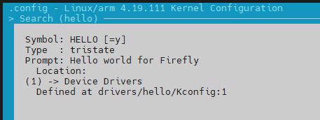

# RV1126添加一个驱动

## 1.创建驱动文件

```
rv1126/kernel/drivers/hello$ tree
.
├── hello.c
├── Kconfig
└── Makefile
```

## 2.驱动文件

> drivers/hello/hello.c

```
#include <linux/kernel.h>
#include <linux/init.h>
#include <linux/module.h> 
#include <linux/delay.h>

static int __init hello_init(void)
{
    int i;
    for(i=0;i<=10;i++)
    {
        printk("~~~~~~~~~~~~~~~~~~~~~~~~Hello world~~~~~~~~~~~~~~~~~~~~~~~~ %d\n",i);		
        mdelay(1000);
	}
    return 0;
}

static void __exit hello_exit(void)
{
    printk("Exit Hello world\n");
}

subsys_initcall(hello_init);
module_exit(hello_exit);

MODULE_AUTHOR("zwwang");
MODULE_DESCRIPTION("hello driver");
MODULE_LICENSE("GPL");

```

## 3.配置文件

> drivers/hello/Makefile

```
obj-$(CONFIG_HELLO)			+= hello.o
```

> drivers/hello/Kconfig

```
config HELLO
	tristate "Hello world for Firefly"
	help
	  Hello for Firefly
```

> drivers/Makefile

```
obj-y				+= hello/
```

>kernel/arch/arm/configs/rv1126_defconfig

```
--- a/kernel/arch/arm/configs/rv1126_defconfig
+++ b/kernel/arch/arm/configs/rv1126_defconfig
@@ -390,3 +390,4 @@ CONFIG_RCU_CPU_STALL_TIMEOUT=60
 # CONFIG_FTRACE is not set
 # CONFIG_RUNTIME_TESTING_MENU is not set
 CONFIG_DEBUG_USER=y
+CONFIG_HELLO=y
```


## 4.选择要编译的驱动

```makefile
$ cd kernel
$ make ARCH=arm menuconfig
```




## 5.编译

```
$ ./build.sh kernel && ./build.sh firmware
```


## 参考

[Firefly-RK3399 第一个编译到内核的驱动程序编制](https://blog.csdn.net/zwwang2014/article/details/88397490)

