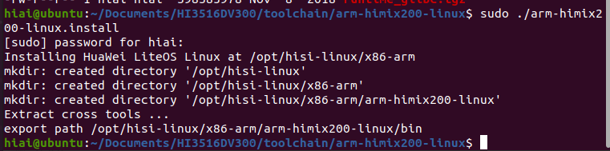
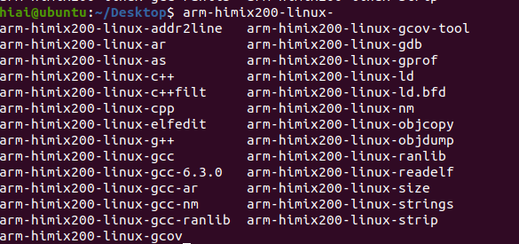
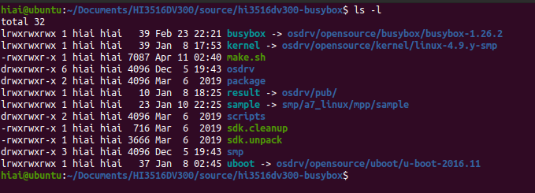
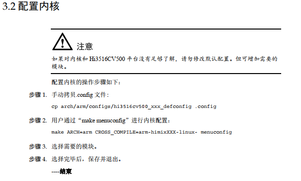

# HiSi

## 1 环境配置

### 1.1 软件包安装

```
sudo dpkg-reconfigure dash 选择 no # 配置默认使用 bash
# 安装依赖包
sudo apt-get install make libc6:i386 lib32z1 lib32stdc++6 zlib1g-dev
libncurses5-dev
sudo apt-get install ncurses-term libncursesw5-dev g++ u-boot-tools:i386 texinfo
sudo apt-get install texlive gawk libssl-dev openssl bc uuid-dev
# 创建/etc/ld.so.preload 文件，并执行 echo "" > /etc/ld.so.preload，以解决 64bit
linux server 上某些第三方库编译失败的问题
sudo touch /etc/ld.so.preload
sudo echo "" > /etc/ld.so.preload
```

## 1.2 编译环境搭建

```
tar –xvf arm-himix200-linux.tgz # 解压交叉编译工具
cd arm-himix200-linux
# 执行脚本自动安装到/opt/hisi-linux/x86-arm/目录下，并且配置交叉编译工具环境变量
sudo ./arm-himix200-linux.install
```



安装完成。

验证：终端输入arm-himix2，然后再输入按tab键，如果自动补全到 arm-himix200-linux- 说明环
境配置成功。如果没有补全成功，执行 source /etc/profile 再测试。  如果再不成功，重启试试看。



## 2 源码

这个部分主要看文档：

《Hi3516CV500╱Hi3516DV300╱Hi3516AV300 开发环境用户指南.pdf》《Hi3516CV500╱Hi3516DV300╱Hi3516AV300 U-boot 移植应用开发指南.pdf》

一下的操作一般都是使用用户权限，没有使用root权限。SDK相关的在：

《Hi3516CV500╱Hi3516DV300 SDK 安装及升级使用说明》，这个包含源码和其他外部相关的目录。

### 2.1 源码目录

```
tar xvf hi3516dv300-busybox-xxx.tgz # 解压源码
cd hi3516dv300-busybox # 进入源码根目录
```

解压后源码：



```
1）make.sh：编译使用的脚本
2）sdk.cleanup：清理整个sdk包的脚本，里面的scripts/common.sh定义了很多函数，提供使用
3）sdk.unpack:是用来解压的
4）osdrv 内核所在目录：
osdrv/opensource/kernel/linux-4.9.y-smp # kernel目录
osdrv/opensource/uboot/u-boot-2016.11 # uboot目录
osdrv/pub/      # uboot kernel rootfs       镜像分别是

```

如果执行sdk.cleanup他会清理sdk下我们添加的文件，所以在使用这个之前要先对sdk进行打包。

### 2.2 配置和编译内核



以上的步骤再海思提供的sdk中可以不管，因为已经提供了脚本，直接进行编译即可。

### 2.3 单独编译各个部分

可以直接用脚本对uboot、kernel、文件系统进行单独编译，具体的直接看`osdrv/readme_cn.txt`，直接使用命令进行编译，或者清除系统编译生成的文件，这些命令都可以在这个目录下找到。（包括单独编译模块ko文件）

## 3 烧录

### 3.1 网口


## 4 uboot设置

如果已经烧录了系统，在使用串口调试的时候，开机的时候，一直按键盘，让他进入uboot，uboot常用的命令如下：

```\
1）设置IP
setenv serverip 192.168.0.100
2）查看环境配置
printenv
3）进入系统
reset
4）保持修改
saveenv
```

## 5 进入系统后


## 6 测试

### 6.1 打开telnet

在板子上设置IP，与电脑的网段一样。然后在电脑上输入命令：

```
telnet 192.168.0.116  // 接着输入用户名和密码=
```

[打开telnet](https://jingyan.baidu.com/article/dca1fa6fe9addbb1a540526a.html)

### 6.2 uart1调试

uart1 串口测试需要使用到调试串口、telnetd，使用 xshell 分别打开调试串口窗口，telnetd 窗口。将uart1 的 tx 、rx 短接 ：

在debug输入命令：

```
stty -F /dev/ttyAMA1 ispeed 115200 ospeed 115200 cs8 # 调试串口，配置串口
microcom -t 10000 -s 115200 /dev/ttyAMA1 # microcom 读数据，10秒无数据，退出
```

打开telnet窗口：

```
echo hello > /dev/ttyAMA1 # telnetd 窗口写数据
```

就可以在debug窗口看到hello。

注意：在debug窗口运行`microcom -t 10000 -s 115200 /dev/ttyAMA1`没有退出之前，在telnet窗口输入`echo hello > /dev/ttyAMA1`才能看到。

如果能看到说明uart1正常。